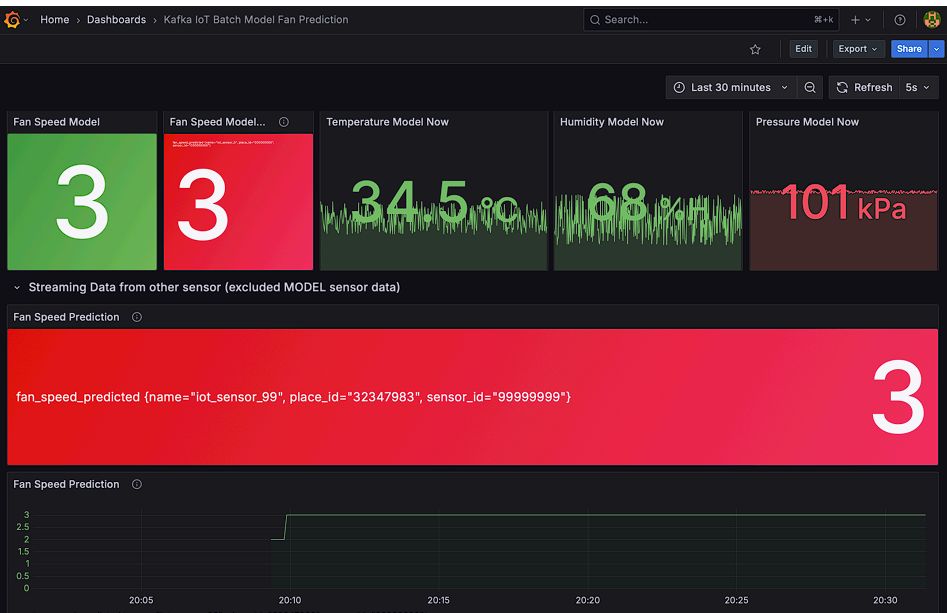

# Online Prediction

<!-- Online Prection ทำงานอย่างไร  -->

## ปิดการใช้งานของ Batch ML ดังนี้

1. kafka-to-json
2. train-from-data
3. predict-then-influxdb

## เริ่มใช้งาน Online ML ดังนี้

1. docker compose down batch ML
2. config .env in online-ml-predict
3. docker compose up online ml

## ผลที่ได้จากการใช้ ML มีดังนี้

<!-- แนบรูป Grafana  พร้อมอธิบาย -->
